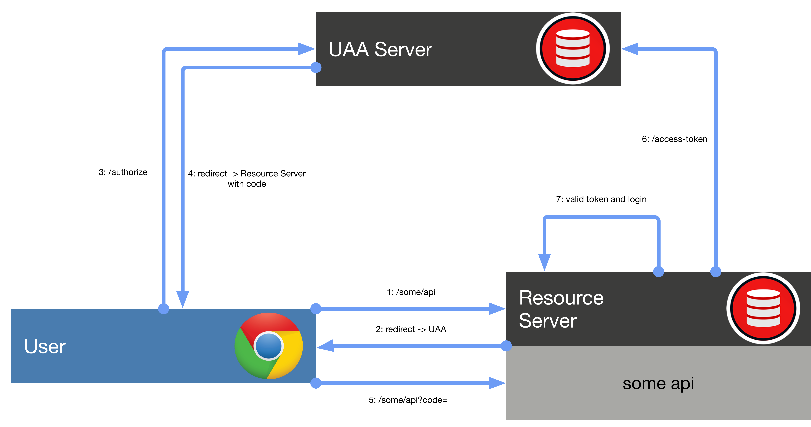

# shiro-uaa


A Simple User Account and Authentication (UAA) Server base on Shiro.

### 来源

当刚开始一个项目时，相信Shiro的简便会成为大多数开发者权限框架的首选，但当项目扩展后，从1到n，并且需要统一认证和授权时，Shiro本身并不支持统一认证和授权成为了限制，Shiro有CasFilter，但是Cas并不容易统一管理授权，所以有了Shiro-UAA

### 为什么用 shiro-uaa

- 单独的 UAA Server
- 纯粹的 Shiro
- 简单，容易扩展

#### 授权流程




#### 说明

- auth-server

  ##### maven

  ```
  <dependency>
      <groupId>com.github.xfslove</groupId>
      <artifactId>shiro-uaa-auth-server</artifactId>
      <version>1.0.0-SNAPSHOT</version>
  </dependency>
  ```

  ##### 内置endpoint

  | URI地址                     | 说明                                  |
  | --------------------------- | ------------------------------------- |
  | /uaa-auth/authorize         | 请求授权的地址，会定向到你的登录页    |
  | /uaa-auth/authorzie/apporve | 同意授权，分发code地址                |
  | /uaa-auth/access-token      | Resource Server获取access-token的地址 |
  | /uaa-auth/logout            | 从UAA登出的地址                       |

  ##### 可扩展api

  | 接口名              | 说明            |
  | ------------------- | --------------- |
  | AccessClientService | 接入系统服务    |
  | AccessTokenService  | AccessToken服务 |
  | AccountService      | 用户服务        |
  | AuthCodeService     | Code服务        |
  | RoleService         | 角色服务        |

  ##### Login

  自定义Login页面和登录验证，implement `org.apache.shiro.authc.credential.CredentialsMatcher` ，实现登录时的校验逻辑

  ##### 扩展的配置参数

  | 参数名                                 | 说明                            |
  | -------------------------------------- | ------------------------------- |
  | shiro.uaa.resource.codeExpires         | UAA分发Code过期时间，秒         |
  | shiro.uaa.resource.accessTokenExpires  | UAA分发AccessToken过期时间，秒  |
  | shiro.uaa.resource.refreshTokenExpires | UAA分发RefreshToken过期时间，秒 |
  | shiro.loginUrl                         | 自定义的登录地址                |

  

- resource-server

  ##### maven

  ```
  <dependency>
      <groupId>com.github.xfslove</groupId>
      <artifactId>shiro-uaa-resource-server</artifactId>
      <version>1.0.0-SNAPSHOT</version>
  </dependency>
  ```

  ##### FilterChainDefinition

  implement `com.github.xfslove.autoconfigure.shiro.filter.CustomFilterChainDefinition` ，定义不同的path经过不同的Filter

  ##### Logout

  先从Resource Server登出，再从UAA登出，加载`com.github.xfslove.autoconfigure.shiro.endpoint.LogoutEndpoint`

  ##### 注解

  和Shiro一样

  | 注解名                  |
  | ----------------------- |
  | @RequiresRoles          |
  | @RequiresPermissions    |
  | @RequiresUser           |
  | @RequiresAuthentication |
  | @RequiresGuest          |

  ##### 扩展的配置参数

  | 参数名                               | 说明                    |
  | ------------------------------------ | ----------------------- |
  | shiro.uaa.resource.serverScheme      | UAA地址的Scheme         |
  | shiro.uaa.resource.serverHost        | UAA地址的Host           |
  | shiro.uaa.resource.serverPort        | UAA地址的Port           |
  | shiro.uaa.resource.serverContextPath | UAA地址的ContextPath    |
  | shiro.uaa.resource.clientId          | UAA分配的ClientId       |
  | shiro.uaa.resource.clientSecret      | UAA分配的ClientSecret   |
  | shiro.logoutUrl                      | Resource Server登出地址 |

#### Lincense

[*Apache 2.0 license*](license).


